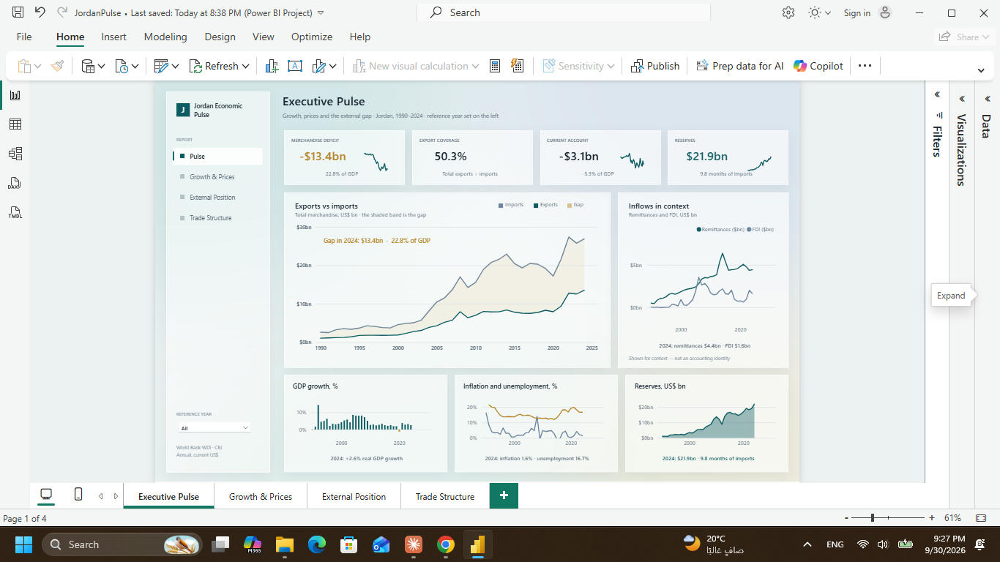
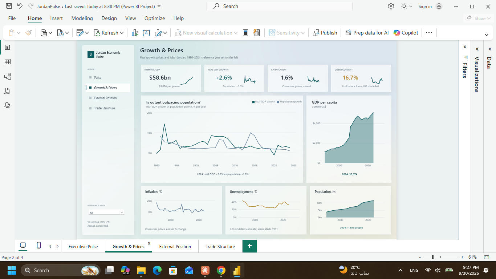
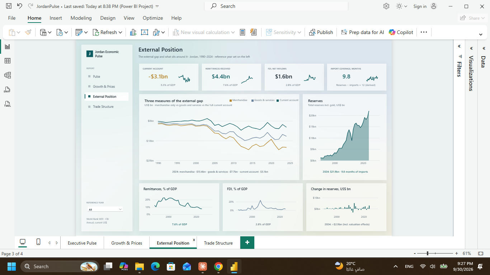
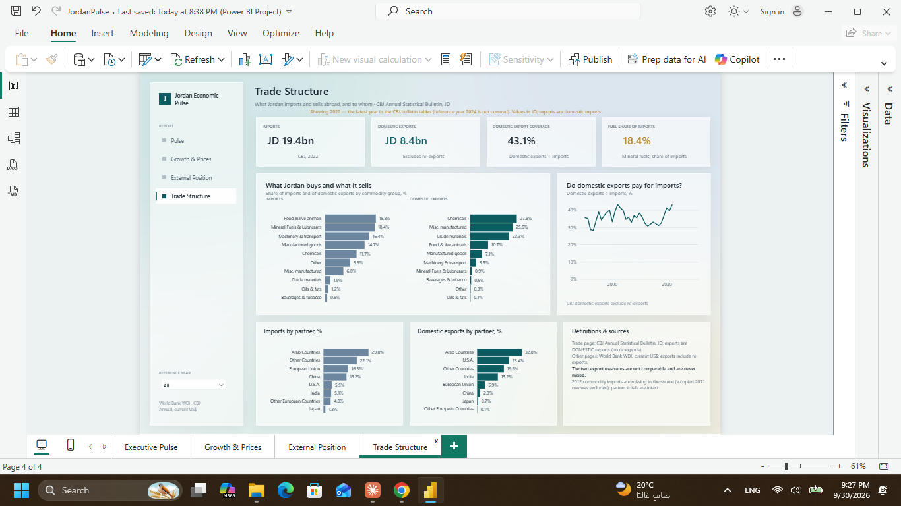
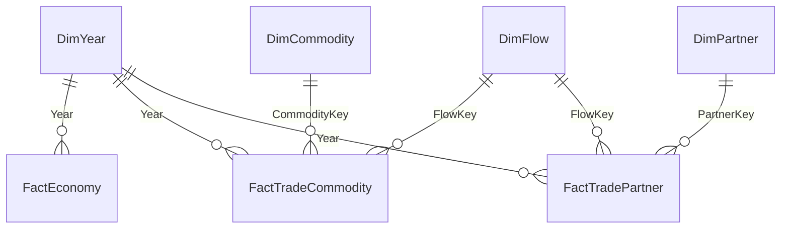

# Jordan Economic Pulse

**Growth, Prices and the External Gap** — a four-page Power BI case study built on official World Bank and Central Bank of Jordan (CBJ) data, 1990–2025.



## The business question

> How has Jordan's external gap evolved, and what external inflows and reserve dynamics provide context for its sustainability?

Jordan runs a large, persistent merchandise trade deficit. This report shows how big it is, how it compares with the broader current account, what sits around it (remittances, FDI, reserves), and what is happening to growth, prices and jobs while it does.

The merchandise deficit is **not** presented as an accounting identity equal to remittances plus FDI plus reserve changes. Each concept is shown separately with its source definition (see [Limitations](#limitations)).

## Report pages

| Page | What it answers |
|---|---|
| **Executive Pulse** | Headline KPIs for the reference year, the exports-vs-imports gap since 1990, remittances and FDI in context, growth, prices and reserves at a glance. |
| **Growth & Prices** | Is output outpacing population? Real GDP growth vs population growth, GDP per capita, inflation, unemployment, population. |
| **External Position** | Three measures of the gap (merchandise balance, net goods and services, current account), reserves, remittances and FDI as % of GDP, change in reserves. |
| **Trade Structure** | What Jordan imports and sells abroad, and to whom: commodity and partner mix (CBJ), domestic export coverage of imports, definitions and sources. |

<p>


</p>
<p>

</p>

Interactions: a **reference-year slicer** in the left rail (synced across pages) drives every KPI and caption, while the time-series charts always show the full history; page navigation from the rail; and a **hover tooltip** on the Executive hero chart that shows imports, exports, gap, export coverage, current account, remittances and reserves for the hovered year.

## Key findings (reference year 2024, latest complete year)

All figures below are reproduced by an independent Python baseline and reconcile exactly with the Power BI DAX (see [Validation](#validation)).

- **The merchandise deficit is $13.4bn, 22.8% of GDP.** Total merchandise exports ($13.5bn) cover 50.3% of imports ($26.9bn). The 1990–2024 average deficit is 31.3% of GDP.
- **The current account gap is much smaller than the goods gap:** −$3.1bn (−5.3% of GDP), against −$13.4bn for merchandise and −$7.7bn for net goods and services.
- **Context inflows:** remittances were $4.4bn (7.6% of GDP) and FDI net inflows $1.6bn; cumulative remittances over 2015–2024 were $46.6bn.
- **Reserves** (World Bank total, including gold) were $21.9bn, equal to 9.8 months of merchandise imports (a derived measure).
- **Growth and jobs:** real GDP grew 2.6% against population growth of 1.0%; average real growth over 2010–2024 was 2.4%. Unemployment was 16.7% (modelled ILO estimate; the 1991–2025 peak was 21.4%), and inflation 1.6%.
- **Trade structure (CBJ, 2022, JD):** imports JD 19.4bn and domestic exports JD 8.4bn, so domestic exports covered 43.1% of imports. Mineral fuels were 18.4% of imports (15.6% in 2000). Chemicals were 27.9% of domestic exports, and Arab countries took 32.8% of domestic exports.

## Data sources

| Source | Used for | Coverage |
|---|---|---|
| **World Bank, World Development Indicators** | 14 Jordan series: GDP, real growth, GDP per capita, CPI inflation, unemployment, population, merchandise exports and imports, net goods and services, current account (US$ and % GDP), remittances, FDI, total reserves | 1990–2025 (2025 provisional) |
| **Central Bank of Jordan, Annual Statistical Bulletin** | Imports and **domestic** exports by commodity group; imports and domestic exports by partner group | 1990–2022, JD thousand |

`data/SOURCES.csv` lists all 49 files that were acquired, with official URL, retrieval date, size and SHA-256, and flags the 18 that feed the model. The other 31 were acquired during exploration and deliberately left out of scope to keep the case focused (for example fiscal, interest-rate and banking series, and a monetary survey with a structural break in 1993).

## Methodology

1. **Reconnaissance and grain** — every source file was inspected row by row; the grain of each table was proved with row counts and distinct keys (`scripts/data_pipeline/m02_*`, `m03_build_tidy.py`).
2. **Full-population data-quality audit** — duplicates, nulls (classified as structural or genuinely missing), zeros, negatives, date gaps, additivity, and cross-source reconciliation. Source defects are logged and excluded, never silently fixed or invented (`docs/audit/`).
3. **Scoping to one case** — the dataset was reduced to what the story needs (`docs/Case_Study_Brief.md`).
4. **Independent baseline** — 38 KPIs computed from the raw files with separate code, before the report was built (`scripts/data_pipeline/m05_baseline.py`).
5. **Semantic model** — star schema, DAX measures, then live DAX reconciliation against the baseline.
6. **Design** — three Figma concepts were explored, then one direction ("Frosted Terminal") was translated into Power BI-native techniques (`docs/Design_Architecture_Brief.md`).
7. **Rendered QA** — every page was inspected in real Power BI Desktop; defects were fixed by class in the generator (`docs/Visual_QA_Log.md`).

## Data model



- **7 tables, 7 single-direction relationships, 105 measures** in a hidden-column, measure-only model. `FactEconomy` is one row per year with the 14 World Bank series; the two CBJ fact tables are year × flow × category (1,214 fact rows in total).
- **Power Query over curated CSVs** (`data/curated/`, 44 KB). DuckDB or Parquet was deliberately not used: at this size it adds cost without benefit.
- Measures follow additivity rules: flows sum; stocks (reserves, GDP level, population) use the latest year in context; rates and ratios are never summed. KPI measures are pinned to a `Reference Year` that defaults to the latest complete year (2024) when no year is selected.
- Details: `docs/Model_Documentation.md`, `docs/Data_Profile.md`.

## Validation

- **38 of 38** independent baseline KPIs equal the live DAX results (`docs/validation/Baseline_Reconciliation.md`).
- Component sums equal Grand Totals in every CBJ trade table within rounding (maximum difference 3 JD thousand).
- World Bank merchandise imports reconcile with CBJ imports at a median ratio of 1.000 (range 0.977–1.027). World Bank exports are about 1.23× CBJ exports because CBJ reports **domestic** exports only; the report labels both and never mixes them.
- The data pipeline and the report generator were re-run from a clean copy of this repository: every data output matched in content, and all 269 generated report files matched the committed report.

## Performance (measured on a 2-core, 7.8 GB RAM PC)

| Metric | Result |
|---|---|
| Source data | 7 CSV files, 44 KB |
| Cold refresh (first refresh after opening) | about 90 s wall-clock |
| Native Power BI Desktop Refresh | about 30–45 s when the UI was responsive, up to about 2 min when it lagged |
| Desktop memory with all pages loaded | PBIDesktop 588 MB, model engine 647 MB (working set; a true peak was not recorded) |

## Limitations

- CBJ exports are **domestic exports** (no re-exports); World Bank exports include re-exports. They are not comparable.
- CBJ trade tables end in 2022, so the Trade Structure page shows 2022 when the reference year is later (the page says so).
- 2012 imports by commodity are missing in the source (the row is a copy of 2011 and was excluded); partner and total series for 2012 are intact.
- 2025 World Bank values are provisional and several balance-of-payments series end in 2024, so charts stop at 2024.
- World Bank total reserves include gold and differ from the CBJ definition; import coverage in months is derived (reserves ÷ merchandise imports × 12).
- "Remittances + FDI as % of the merchandise deficit" is a context ratio, not an accounting identity.
- Power BI Desktop (2.158.1177.0) behaviours worked around: the year slicer is a multi-select checklist (KPIs use the latest selected year); background blur and mesh gradients from the design concept cannot be reproduced, so the glass look is approximated with translucent panels, hairlines and a soft canvas image; very small charts will not render, so sparklines need about 112×84 px.
- No drill-through, bookmarks or dark theme.

## How to open and use

**Requirements:** Power BI Desktop (developed and verified on 2.158.1177.0) with the Power BI Project (`.pbip`) format enabled.

1. Clone this repository.
2. Open `powerbi/JordanPulse.pbip` in Power BI Desktop.
3. The model reads the curated CSVs through a single parameter. In **Transform data → Manage parameters**, set `DataFolder` to the absolute path of this repository's `data\curated\` folder, **with a trailing backslash** (the committed value is a placeholder).
4. Press **Refresh**. Allow 1–2 minutes on a modest machine.
5. Use the left rail to move between pages and the **Reference year** slicer to change the year; with nothing selected the report shows 2024.

## Reproducing the data and the report

```bash
pip install pandas openpyxl pillow
# 1. Download the raw files listed in data/SOURCES.csv into data/raw/ (see data/raw/README.md); verify SHA-256.
python scripts/data_pipeline/m03_build_tidy.py   # parse + audit -> data/staging, docs/audit
python scripts/data_pipeline/m03c_wb_audit.py    # World Bank null / anomaly audit
python scripts/data_pipeline/m04_curate.py       # -> data/curated (model inputs)
python scripts/data_pipeline/m05_baseline.py     # independent baseline -> docs/validation
# Regenerate the whole report folder from the design system (close Power BI Desktop first):
python scripts/report_builder/build_report.py
```

## Repository structure

```
powerbi/                 Power BI project (PBIP): report (PBIR), semantic model (TMDL), theme, canvas image
data/
  curated/               7 model input CSVs (44 KB)
  SOURCES.csv            official URL, retrieval date, size and SHA-256 for every source file
  raw/                   not committed: re-download per SOURCES.csv
docs/
  Case_Study_Brief.md    case, questions, scope, grain, page architecture
  Data_Profile.md        coverage, grain, quality audit, additivity rules
  Model_Documentation.md model tables, relationships, measure design
  Design_Architecture_Brief.md  design direction and its translation to Power BI
  Visual_QA_Log.md       defects found in rendered QA and how each was fixed
  Project_Report.md      verified results, performance, limitations
  validation/            independent baseline and DAX reconciliation
  audit/                 data-quality audit outputs and excluded source rows
scripts/
  data_pipeline/         recon, tidy and audit, curate, independent baseline
  report_builder/        PBIR generator (design system + page definitions)
assets/                  final page screenshots and the three design concepts
```

## Tools

Power BI Desktop (PBIP / PBIR / TMDL), DAX, Power Query (M), Python 3.13 (pandas, openpyxl, Pillow), Figma (design concepts).

## Data terms

The curated tables are small derived extracts of public statistics from the World Bank (World Development Indicators) and the Central Bank of Jordan. The original data remains subject to those publishers' terms of use; see the URLs in `data/SOURCES.csv`.

---

*Author: Musab AbuKaraki.*
